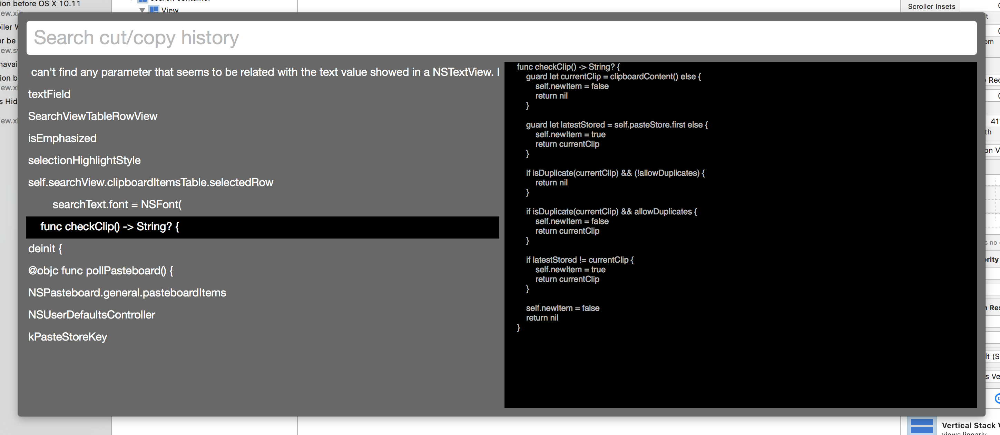
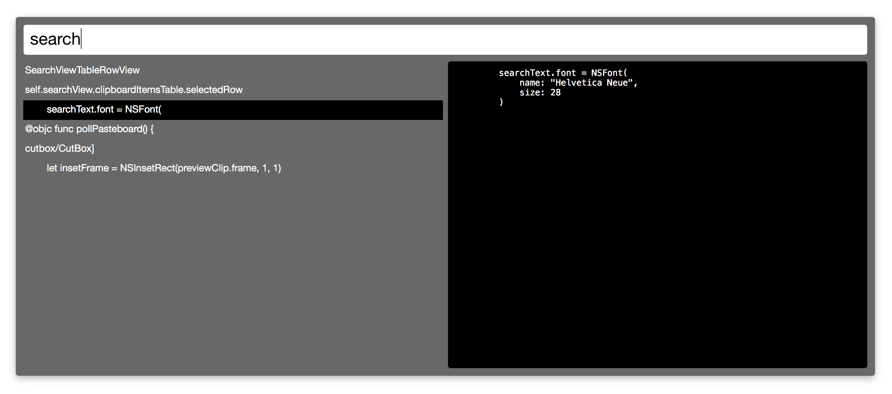

# CutBox

a nice little pasteboard timemachine

## About CutBox

CutBox keeps your pasteboard cut/copy history and lets you paste
anything back to your current app by fuzzy searching for items.

CutBox is inspired by [JumpCut](https://github.com/snark/jumpcut) & [Flycut](https://github.com/TermiT/Flycut)

# Download / install...

You can find the latest release here: https://github.com/ocodo/CutBox/releases/latest

Please note, CutBox.app is built as "Mac Developer" so when you
install, Macos will give a security warning, that it was built
by an unidentified developer.  [I am that unidentified developer!](https://github.com/jasonm23)

As a side note, CutBox will not be on the Mac AppStore.

## How to use CutBox

CutBox will be available from the Macos top menu and a global hotkey
combo <kbd>**Cmd**</kbd> + <kbd>**Opt**</kbd> + <kbd>**Ctrl**</kbd> + <kbd>**V**</kbd>

Search the cut/copy history by typing (search uses fuzzy matching)
Select from the search results using <kbd>**up**</kbd> and <kbd>**down**</kbd>, or select with the mouse.

Once you've selected an item, press <kbd>**Enter**</kbd> to paste it to the current app.

If you want to exit without pasting, press <kbd>**Esc**</kbd>

(If you click the mouse away from the search popup it'll exit too.)

# Development note

If you have suggestions or bugs, please add to https://github.com/ocodo/CutBox/issues

# Licence

> CutBox is free software: you can redistribute it and/or modify
> it under the terms of the GNU General Public License as published by
> the Free Software Foundation, either version 3 of the License, or
> (at your option) any later version.
>
> CutBox is distributed in the hope that it will be useful,
> but WITHOUT ANY WARRANTY; without even the implied warranty of
> MERCHANTABILITY or FITNESS FOR A PARTICULAR PURPOSE.  See the
> GNU General Public License for more details.
>
> You should have received a copy of the GNU General Public License
> along with this program.  If not, see <http://www.gnu.org/licenses/>.
