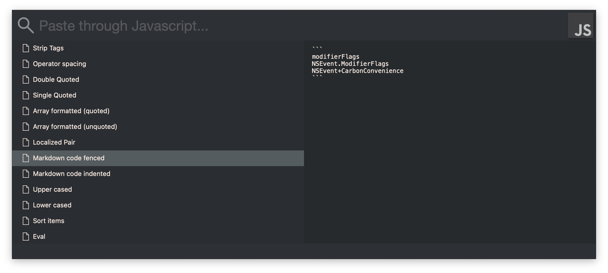

<p align="center">
  
</p>
<p align="center">

</p>

<p align="center">
  <a href="https://github.com/cutbox/CutBox/actions/workflows/xcode-build.yml"></a>&nbsp;&nbsp;<a href="https://app.codacy.com/gh/cutbox/CutBox/dashboard?utm_source=github.com&amp;utm_medium=referral&amp;utm_content=cutbox/CutBox&amp;utm_campaign=Badge_Grade" title="high quality software"></a>&nbsp;<a href="https://app.codacy.com/gh/cutbox/CutBox/dashboard"></a>&nbsp;&nbsp;<a href="https://cutbox.github.io/CutBox/"></p></a>
<div align="center">
  <p>Make you macOS pasteboard awesome...</p>

  <a href="https://github.com/cutbox/CutBox/releases/latest"></a>
  
</div>

[](https://github.com/sponsors/cutbox)&nbsp;&nbsp;[](https://gitter.im/CutBox/Lobby)

CutBox is a clipboard manager for MacOS, designed for developers. Search using fuzzy matching or regular expressions. Multiple clipboard items can be pasted at once.  You can also filter to a time limit, e.g. "10 min" will show items copied in the last 10 min, you can text search on just those items. 

- - -

CutBox also has advanced JavaScript and Shell command features. Using `require(javascript_file)` and/or `shell(commandWithArgs)` you can process text through any JS library or shell command before pasting it into your workflow.

- - -

Cutbox also has a command-line interface called `cutbox`. It allows you to fetch items from history, filter by search, and get n entries from the most recent or searched items. [See below](https://github.com/cutbox/CutBox/blob/master/README.md#command-line-access)

- - -

Originally Inspired by [JumpCut](https://github.com/snark/jumpcut) & [Flycut](https://github.com/TermiT/Flycut)

## Using CutBox

CutBox Search is activated using a global hotkey, by default:

<kbd>**Cmd**</kbd> + <kbd>**Shift**</kbd> + <kbd>**V**</kbd>


Also Compact UI mode, which expands as above when searching.


Any text you copy on MacOS is saved to CutBox's history.

(This can be customized in preferences.)

Optionally paste through a function or shell process:



### Search and Paste

With the CutBox window open, search for anything you copied.

Press <kbd>**Enter**</kbd> and the selected item will paste into your
current app.

To exit press <kbd>**Esc**</kbd>.

# Keyboard Shortcuts

| Shortcut Keys                              | Action                                                                                    |
|--------------------------------------------|-------------------------------------------------------------------------------------------|
| <kbd>Esc</kbd>                             | Exit search                                                                               |
| <kbd>Ctrl</kbd><kbd>g</kbd>                | Exit search                                                                               |
| <kbd>Enter</kbd>                           | Paste selected                                                                            |
| <kbd>Cmd</kbd><kbd>Enter</kbd>             | Paste through JavaScript Functions selected (you'll need `~/.cutbox.js` set up)           |
| <kbd>Cmd</kbd><kbd>Comma</kbd>             | Open preferences                                                                          |
| <kbd>Cmd</kbd><kbd>Delete</kbd>            | Delete selected item(s)                                                                   |
| <kbd>Cmd</kbd><kbd>Comma</kbd>             | Open preferences                                                                          |
| <kbd>Cmd</kbd><kbd>t</kbd>                 | Toggle color themes                                                                       |
| <kbd>Cmd</kbd><kbd>p</kbd>                 | Toggle preview                                                                            |
| <kbd>Cmd</kbd><kbd>Shift</kbd><kbd>=</kbd> | Zoom/scale up text                                                                        |
| <kbd>Cmd</kbd><kbd>Shift</kbd><kbd>-</kbd> | Zoom/scale down text                                                                      |
| <kbd>Cmd</kbd><kbd>Shift</kbd><kbd>0</kbd> | Reset text scale/zoom                                                                     |
| <kbd>Cmd</kbd><kbd>-</kbd>                 | Toggle join mode (paste multiple items, joined by newline or string: Set in preferences)  |
| <kbd>Cmd</kbd><kbd>[</kbd>                 | Toggle wrap mode (paste multiple items, wrapped by a pair of strings: Set in preferences) |
| <kbd>Cmd</kbd><kbd>s</kbd>                 | Toggle search modes, fuzzy match, regexp/i or regexp                                      |
| <kbd>Cmd</kbd><kbd>f</kbd>                 | Toggle search by favorites / everything (use the right click menu, to favorite)           |
|                                            |                                                                                           |
| **Time limit filter**                      |                                                                                           |
| <kbd>Cmd</kbd><kbd>h</kbd>                 | Toggle search within time limit                                                           |
| <kbd>Enter</kbd> (in time limit input)     | Switch to text search input                                                               |
|                                            |                                                                                           |
| **In items list**                          |                                                                                           |
| <kbd>Alt</kbd><kbd>up</kbd>                | Move to top of items                                                                      |
| <kbd>Alt</kbd><kbd>down</kbd>              | Move to top of items                                                                      |
| Hold <kbd>Shift</kbd>                      | Expand single selection to new item, standard shift select                                |
| Hold <kbd>Cmd</kbd>                        | Expand selection to new items, multiple selection groups, standard command select         |

### Status bar menu

Use the status item to open Cutbox with the mouse, and access options: 


# Installation

## Install via Homebrew Cask - Recommended

Install the compiled package.
```sh
brew tap cutbox/cutbox
brew install --cask cutbox
```

Read the notes shown by homebrew and follow the 

## Install by downloading the release DMG

Open the CutBox latest release page [cutbox/CutBox/releases/latest](https://github.com/cutbox/CutBox/releases/latest )

Download the DMG and open it on macOS. You'll find `CutBox.app` & `cutbox` (cli tool) inside.


Drag the `.app` to `/Applications` and copy `cutbox` to your somewhere in exec `$PATH`, for example, `/usr/local/bin`.

Follow the [macOS Security Settings First Run](#macOs-Security-Settings-First-Run) section.

## Install via Homebrew formula

Builds the package from source, a full Xcode installation needed.

```sh
brew tap cutbox/cutbox
brew install cutbox
```
## macOS Security Settings First Run

When you first run CutBox Macos will prompt you that the developer cannot be identified.

[Please read this post from Apple.](https://support.apple.com/en-us/HT202491#:~:text=If%20you%20want%20to%20open%20an%20app%20that%20hasn%E2%80%99t%20been%20notarized%20or%20is%20from%20an%20unidentified%20developer)

If you prefer to install open source software that isn't notarized (such as CutBox, Chromium or other large free opensource projects.) on your Mac, you can do this in the terminal.

```sh
sudo spctl --master-disable
```

I only recommend this if you feel comfortable using free software that you can code audit.

CutBox doesn't participate in Apple notarisation. CutBox will be free and open forever, and is licensed under GNU/GPL3, so the source is always available. Donations are important to help keep it developed and improved.

CutBox is [quality checked by Codacy](https://app.codacy.com/gh/cutbox/CutBox/dashboard?utm_source=github.com&utm_medium=referral&utm_content=cutbox/CutBox&utm_campaign=Badge_Grade).  

`CutBox.app` and `cutbox` releases are build using Github actions, so you can also inspect the entire test/deploy/delivery chain online at  [cutbox/CutBox](https://github.com/cutbox/CutBox/actions).

If you have any concerns about the integrity of your CutBox.app, make sure to build it directly from source on your local machine, this is easily achieved using Homebrew and installing XCode.  See [Install via Homebrew formula](#Install-via-Homebrew-formula)

## Permissions to enable CutBox paste 

After installation or upgrade, the CutBox.app requires security permission for Accessibiliy. This is so that it can paste by faking <kbd>Cmd</kbd>+<kbd>V</kbd>.

Open **System Preferences -> Security & Privacy -> Privacy -> Accessibility**

Unlock the panel and add CutBox to the list of apps (also switch on the check box next to its icon). 

If CutBox is already in the list of apps, you have to remove and replace it with the new version installed.

 Security & Privacy -> Privacy -> Accessibility">

### Please Note

CutBox.app must be restarted, for Accessibility permissions to activate. (macOS will suggest restarting CutBox anyway.)

# Command line access

CutBox also has a CLI tool to access history via the terminal.  Download the CLI command `cutbox` from [releases](https://github.com/cutbox/CutBox/releases). (From v1.5.8 onwards.)

Note the CLI only performs read-only actions on CutBox history.

CutBox history CLI
==================

Display items from CutBox history. Most recent items first.

    cutbox [options]

Options:
========

Search
------

    -f or --fuzzy <query>   Fuzzy match items (case insensitive)
    -r or --regex <query>   Regexp match items
    -i or --regexi <query>  Regexp match items (case insensitive)
    -e or --exact <string>  Exact substring match items (case sensitive)

Filtering
---------

    -l or --limit <num>     Limit to num items
    -F or --favorites       Only list favorites
    -M or --missing-date    Only list items missing a date (copied pre CutBox v1.5.5)

Filter by time units e.g. 7d, 1min, 5hr, 30s, 25sec, 3days, 2wks, 1.5hours, etc.
Supports seconds, minutes, hours, days, weeks.

    --since <time>
    --before <time>

Filter by ISO 8601 date e.g. 2023-06-05T09:21:59Z

    --since-date <date>
    --before-date <date>

Info
----

    --version               Show the current version
    -h or --help            Show this help page

# Would you like to know more?

[More information is in the wiki](https://github.com/cutbox/CutBox/wiki)

# Found something wrong?

If you find a bug, [click here to tell me what happened.](https://github.com/cutbox/CutBox/issues/new?template=ISSUE_TEMPLATE.md)

# Contributing

- Pull requests must have test cover, existing tests should not break.
- Open an issue if tests are already failing, so I know I need to fix them.
- Code must pass the quality checks as used by Codacy.

### Clone and setup dependencies

```text
git clone git@github.com:CutBox/CutBox
```

### Compilation setup / tooling

```sh
bin/setup
```

To build **CutBox.app**:

```sh
bin/build
```

Run the local CutBox.app with terminal logging...

```sh
CutBox/build/CutBox.app/Contents/MacOS/CutBox
```

To use the newly built **CutBox.app** and move it to `/Applications/CutBox.app`:

```sh
bin/use_build_as_local_app
```

When build is complete it'll automatically open **System Preferences** >
**Security & Privacy** > **Privacy**. Select the **Accessibility** list and add
**/Applications/CutBox.app** 

(Note if there is already a CutBox entry, remove it first, and add the new one.  For any app, each build must be assigned permissions specifically.)

 Security & Privacy -> Privacy -> Accessibility">

This is so **CutBox.app** can paste.

# Troubleshooting

[Visit Gitter chat here, if you have problems getting up and running](https://gitter.im/CutBox/Lobby) 

Or open an issue https://github.com/cutbox/CutBox/issues

### FAQs

- When I do <kbd>Cmd</kbd> <kbd>Shift</kbd> <kbd>v</kbd> in other apps, CutBox opens.  I need that command in another app!
    - Change the CutBox hotkey to be something you're happy with, in CutBox preferences (in the macOS status-bar menu)
- My JS functions aren't loading from my `~/.cutbox.js`?
    - Make sure you are using `this.cutboxFunctions` or `globalThis.cutboxFunctions` using `var cutboxFunctions` or `let cutboxFunctions` will not work as expected.
- When I select item to paste, and press enter, nothing happens.
    - CutBox permissions must be set, [read this section](#permissions-to-enable-cutbox-paste)
- I can't start CutBox, macOS says it's "potentially malware"
  - Apple seems to confuse independent open source software, with "potential malware", this seems dishonest.
  - To enable CutBox follow the guide on [macos security settings](#macos-security-settings-first-run)

# Thank You...

CutBox has contributions from Carlos Enumo, Dávid Geréb, Denis Stanishevskiy,
with support from Adam Johnson.

Thanks for you contriubutions and continued support. 

# Licence

> CutBox is free software: you can redistribute it and/or modify
> it under the terms of the GNU General Public License as published by
> the Free Software Foundation, either version 3 of the License, or
> (at your option) any later version.
>
> CutBox is distributed in the hope that it will be useful,
> but WITHOUT ANY WARRANTY; without even the implied warranty of
> MERCHANTABILITY or FITNESS FOR A PARTICULAR PURPOSE.  See the
> GNU General Public License for more details.
>
> You should have received a copy of the GNU General Public License
> along with this program.  If not, see <http://www.gnu.org/licenses/>.
