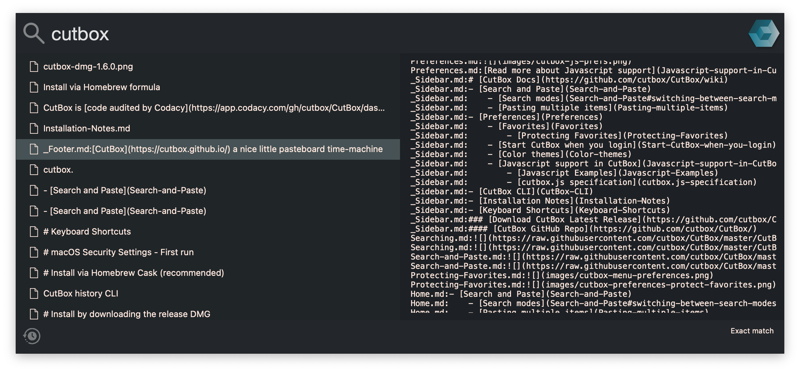
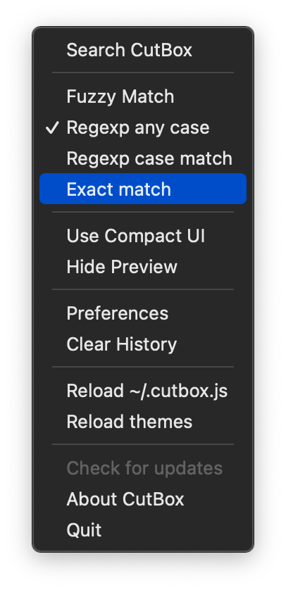
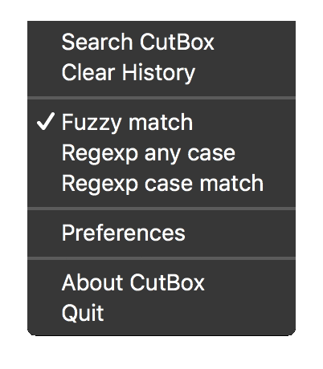

<p align="center">
  
</p>

<p align="center">
  <a href="https://gitter.im/CutBox/Lobby" title="Chat about CutBox"/></a>&nbsp;<a href="https://www.codacy.com/gh/cutbox/CutBox/dashboard?utm_source=github.com&amp;utm_medium=referral&amp;utm_content=cutbox/CutBox&amp;utm_campaign=Badge_Grade"></a>&nbsp;<a href="https://github.com/cutbox/CutBox/actions/workflows/xcode-build.yml"></a>
</p>

<div align="center">
    <h1>CutBox</h1>
  <p>Macos Clipboard Manager</p>
</div>

CutBox is a Macos developer focused clipboard history manager. It works only with text (no images, audio, video, blobs) but doesn't interfere with the system clipboard, or other clipboard managers, if you need copy/pasteboard history for things like that.  It's  maing strenghts are fuzzy & regexp search, and the ability to transform text using JavaScript, before you paste it.

# Install via Homebrew Cask

```
brew tap cutbox/cutbox
brew intall cutbox
```

# First run...

When you first run CutBox Macos will prompt you that the developer cannot be identified.

[Please read this post from Apple.](https://support.apple.com/en-us/HT202491#:~:text=If%20you%20want%20to%20open%20an%20app%20that%20hasn%E2%80%99t%20been%20notarized%20or%20is%20from%20an%20unidentified%20developer)

# Enable automatic paste.

Before CutBox can paste for you (when you select something and hit enter that is.) You have to enable it to control the keyboard.

Go to **System Preferences -> Security & Privacy -> Privacy -> Accessibility**

Unlock and add CutBox to the list of apps (also switch on the check box next to its icon). 

Do the same for input monitoring...:

Go to **System Preferences -> Security & Privacy -> Privacy -> Input Monitoring**

Make sure CutBox is in the list and its checkbox is on.

These work best before CutBox is run. (Macos will suggest restarting CutBox anyway, wait for the CutBox icon to appear before changing a checkbox in security preferences.)

FYI If you're upgrading, you'll need to remove and re-add the new CutBox.app.


# About CutBox

CutBox keeps your pasteboard cut/copy history and lets you paste
anything back to your current app by searching for items.

Inspired by [JumpCut](https://github.com/snark/jumpcut) & [Flycut](https://github.com/TermiT/Flycut)




As well as copy / paste history you can:

- Make items favorite
- Select and paste multiple items joined as a single piece of text.

Anything else?

- You can send your pasted text through [Javascript functions](https://github.com/cutbox/CutBox/wiki/Javascript-support-in-CutBox)

# Download / install...

Get the current release:

https://github.com/cutbox/CutBox/releases/download/1.4.21/CutBox.dmg

You can also compile yourself... [Compile instructions](#compilation-setup--tooling)

## Using CutBox

Any text you copy on MacOS is saved to CutBox's history.



CutBox Search is activated using a global hotkey:

<kbd>**Cmd**</kbd> + <kbd>**Shift**</kbd> + <kbd>**V**</kbd>

(This can be customized in preferences.)

### Searching and pasting


With the CutBox window open, search for anything you copied.

Press <kbd>**Enter**</kbd> and the selected item will paste into your
current app.

To exit just press <kbd>**Esc**</kbd>.



Press <kbd>Cmd</kbd> + <kbd>s</kbd> to toggle through search modes,
fuzzy match, regexp/i or regexp.

# Would you like to know more?

[More information is in the wiki](https://github.com/cutbox/CutBox/wiki)

# Bugs...

If you find a bug, [click here to tell me what happened.](https://github.com/cutbox/CutBox/issues/new?template=ISSUE_TEMPLATE.md)

# Developers

- Pull requests must have test cover, existing tests should not break.
- Open an issue if tests are already failing, so I know I need to fix them.
- Code must pass the quality checks as used by Codacy.

### Clone and setup dependencies

    git clone git@github.com:CutBox/CutBox

### Compilation setup / tooling

```
gem install cocoapods
cd CutBox
pod install
cd ..
```

To build **CutBox.app**:

```
bin/build
open CutBox/build/
```

Run the local CutBox.app with terminal logging...

```
CutBox/build/CutBox.app/Contents/MacOS/CutBox
```

# Troubleshooting

There's a Gitter channel if you have problems getting up and running (https://gitter.im/CutBox)

# Licence

> CutBox is free software: you can redistribute it and/or modify
> it under the terms of the GNU General Public License as published by
> the Free Software Foundation, either version 3 of the License, or
> (at your option) any later version.
>
> CutBox is distributed in the hope that it will be useful,
> but WITHOUT ANY WARRANTY; without even the implied warranty of
> MERCHANTABILITY or FITNESS FOR A PARTICULAR PURPOSE.  See the
> GNU General Public License for more details.
>
> You should have received a copy of the GNU General Public License
> along with this program.  If not, see <http://www.gnu.org/licenses/>.
