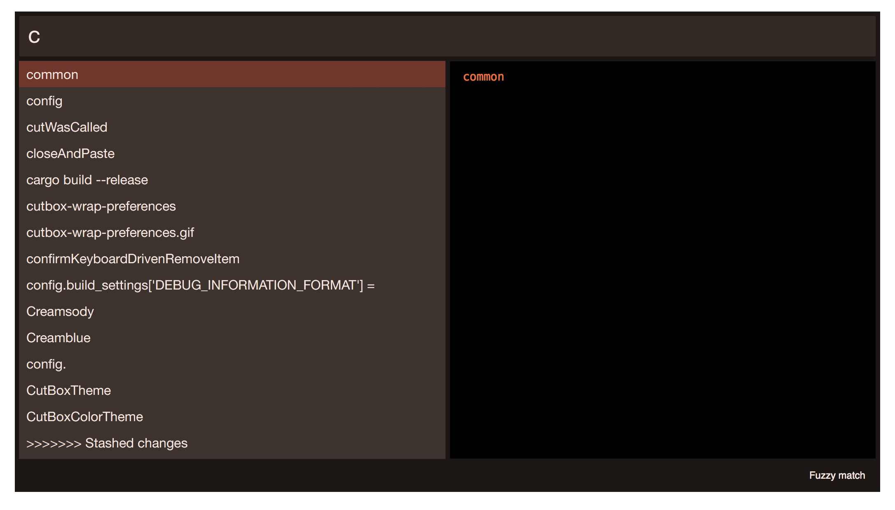
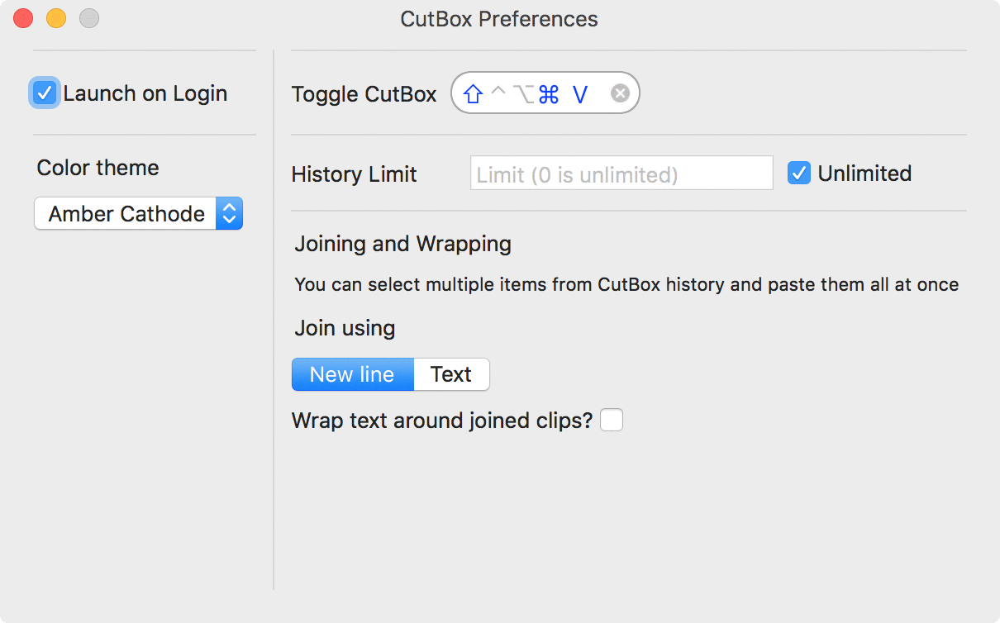

# CutBox

a nice little pasteboard timemachine

## About CutBox

CutBox keeps your pasteboard cut/copy history and lets you paste
anything back to your current app by searching for items.

CutBox is inspired by [JumpCut](https://github.com/snark/jumpcut) & [Flycut](https://github.com/TermiT/Flycut)

CutBox only deals in plaintext for now, I'm thinking about image and
other document types down the road, but I needed some specific things
from a plaintext pasteboard history, so here we are.

# Download / install...

You can find the latest release here: https://github.com/ocodo/CutBox/releases/latest

Please note, CutBox.app is built as "Mac Developer" so when you
install, Macos will give a security warning, that it was built
by an unidentified developer.  [I am that unidentified developer!](https://github.com/jasonm23)

As a side note, CutBox will not be on the Mac AppStore.

## How to use CutBox

CutBox runs as a status menu icon and provides a global hotkey
to show and hide it's main window:

<kbd>**Cmd**</kbd> + <kbd>**Shift**</kbd> + <kbd>**V**</kbd>

Search the cut/copy history by typing (search uses fuzzy matching or
regexp use <kbd>**Cmd**</kbd> + <kbd>**S**</kbd> to toggle search
modes).

Choose from the search results using <kbd>**up**</kbd> and
<kbd>**down**</kbd>, or select with the mouse.

Once you've selected an item, press <kbd>**Enter**</kbd> to paste it
to the current app.

If you want to exit without pasting, press <kbd>**Esc**</kbd>

(If you click the mouse away from the search popup it'll exit too.)

You can also select search mode from the CutBox menu.

## Color themes

CutBox also has a few color themes for you to choose from:

**Darkness**

**Skylight**

**Sandy Beach**

**Darktooth**

**Creamsody**

**Purplehaze**

**Verdant**

**Amber Cathode**

## Advanced use...

### Multi item select and paste

CutBox also allows you to select multiple pasteboard items and paste
them all back in one go.

For example, let's say I have a bunch of web links I want to collect.

1. Right click each link and copy address
1. Repeat (1) until I've copied them all
1. Switch to the application you want to copy all the links to
1. Open CutBox switch to regexp mode with [<kbd>**Cmd**</kbd> + <kbd>**S**</kbd>] (you'll see search mode change at the bottom right)
1. Search CutBox for **`https?:`**
1. Select all the links you want to paste with [mouse and/or keyboard shortcuts](https://support.apple.com/kb/PH25306)
1. Press enter to paste all the items.

All your links will be pasted with new-lines in between each one.

### Join items with strings and/or wrap them

Mutli-item paste is configurable so you can choose a string to join
between the items, and you can also wrap a pair of strings around the
start and end.

For example, if I wanted to collect a list of numbers from various different place to paste into a piece of code, usually I'd need to edit them after copy pasting them one by one.

With CutBox I don't have to do that.  Now I can just do this:

1. Set CutBox search mode to regexp
1. Set my join and wraping strings up in CutBox preferences
1. e.g. my target is JavaScript code, I want to use an array of decimal numbers
    1. Set my join string to `, `
    1. Set wrapping on
        1. Set my start string to `let numberArray = [`
        1. Set my end string to `]`
    1. close preferences
1. Copy each item, from wherever they are until I've copied them all
1. Switch to my code editor
1. Open CutBox search and enter `^\d+\.\d+$` (i.e. match all floating point numbers)
1. Select the items with the mouse / keyboard
1. Press enter to paste all the items.
1. (Assuming you copied these numbers: 93.13 44.52 52.21 32.14)
1. You'll have something like...

        let numberArray = [32.14, 52.21, 44.52, 93.13]

Note: at the moment the sort order of the items will be in the reverse order you copied the items.  For example, I copy 1, then 2, then 3, When I paste them back... I get `3 2 1`.

You can use wrapping and joining to do a bunch of things.  I'm interested to hear what you use it for. Tweet me at [@ocodo](https://twitter.com/ocodo)

If you'd like more features in CutBox open a new issue and mark it _enhancements_.

# Development

If you have suggestions or bugs, please let me know using https://github.com/ocodo/CutBox/issues

# Licence

> CutBox is free software: you can redistribute it and/or modify
> it under the terms of the GNU General Public License as published by
> the Free Software Foundation, either version 3 of the License, or
> (at your option) any later version.
>
> CutBox is distributed in the hope that it will be useful,
> but WITHOUT ANY WARRANTY; without even the implied warranty of
> MERCHANTABILITY or FITNESS FOR A PARTICULAR PURPOSE.  See the
> GNU General Public License for more details.
>
> You should have received a copy of the GNU General Public License
> along with this program.  If not, see <http://www.gnu.org/licenses/>.
